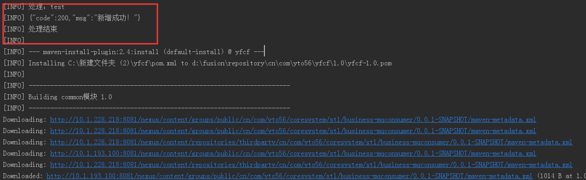
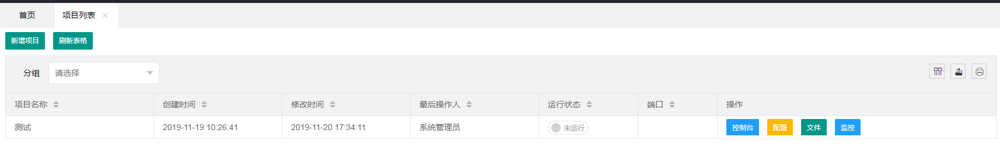
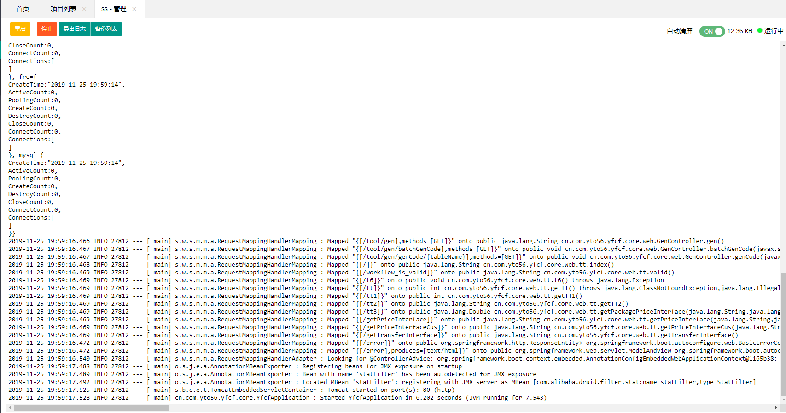

### 插件作用
通过maven插件可以自动把项目的jar包，加入到yfcf-monitor监控系统中

> 项目地址

<https://github.com/myzf/jpom-maven-plugin.git>

> 使用前先创建yfcf-monitor节点,节点就是ssh服务器的信息

1. 在项目pom 中添加插件如下，具体配置信息请自行修改为对应项目

```
 <plugin>
                <groupId>io.github.myzf</groupId>
                <artifactId>monitor-maven-plugin</artifactId>
                <version>1.0.1</version>
                <configuration>
                    <!--节点地址 -->
                    <url>http://127.0.0.1:2122</url> <!-- yfcf-monitor服务器的地址 -->
                    <nodeIds>
                        <nodeId>test</nodeId>  <!--节点的id -->
                    </nodeIds>
                    <!--用户token -->
                    <token>5610b7db99f7216e4ed3543f2a56eb95</token> <!--用于通过yfcf-monitor登陆验证 -->
                    <project> <!--节点中的 管理项目配置信息 -->
                        <name>测试</name> <!--项目名称 -->
                        <id>yfcf</id>  <!--项目ID -->
                        <runMode>Jar</runMode>  <!--运行方式 -->
                        <path>ttttt</path> <!--项目文件夹 -->
                        <whitelistDirectory>/c:/</whitelistDirectory> <!--项目路径 -->
                        <!--非必填-->
                        <group>java</group> 
                        <mainClass></mainClass> <!--MainClass  当运行方式是ClassPath时填写-->
                        <jvm>-xms 512M</jvm> <!--运行方式 -->
                        <args></args> <!--args参数 -->
                        <webHook></webHook> <!--WebHooks -->
                    </project>
                    <nodeProjects>
                        <nodeProject>
                            <nodeId>test</nodeId>
                            <args>--spring.profiles.active=dev</args>
                        </nodeProject>
                    </nodeProjects>
                </configuration>
                <executions>
                    <execution>
                        <goals>
                            <goal>yfcf-project</goal> <!--执行的moto值 -->
                        </goals>
                    </execution>
                </executions>
            </plugin>
```

2. 执行命令

```
mvn clean package
```


3. 效果图

 
 
 