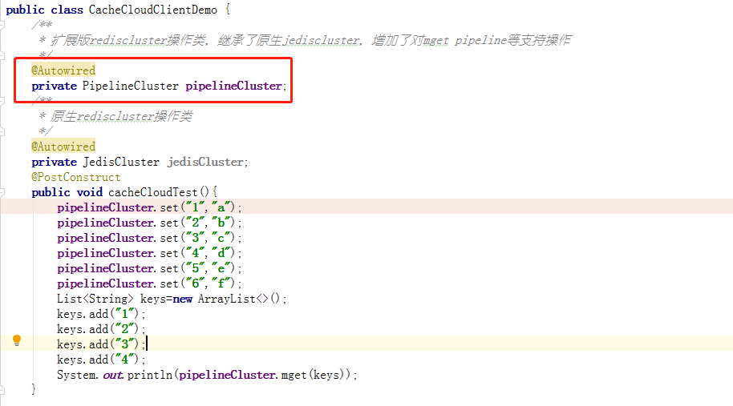

1.引入依赖

```
<dependency>
    <groupId>cn.yto.framework</groupId>
    <artifactId>yto-core-cachecloud</artifactId>
    <version>2.1.3-SNAPSHOT</version>
</dependency>
```

私服地址为http://10.130.36.231:8081/nexus/content/groups/public/

2.添加配置
```
http_conn_timeout = 3000
http_socket_timeout = 5000
client_version = 1.0-SNAPSHOT
domain_url = http://10.130.36.241:8585
redis_cluster_suffix = /cache/client/redis/cluster/%s.json?clientVersion=
redis_sentinel_suffix = /cache/client/redis/sentinel/%s.json?clientVersion=
redis_standalone_suffix = /cache/client/redis/standalone/%s.json?clientVersion=
cachecloud_report_url = /cachecloud/client/reportData.json
cachecloud.appid=10003
cachecloud.connetionTimeout=1000
cachecloud.soTimeout=1000
cachecloud.maxRedirections=6
cachecloud.maxTotal=1500
cachecloud.maxIdle=1000
cachecloud.minIdle=0
cachecloud.maxWaitMillis=3000
cachecloud.isJmx=true
```

至此客户端接入已完成。

3.使用实例 在项目中需要使用redis操作的地方注入操作类即可操作redis

  
