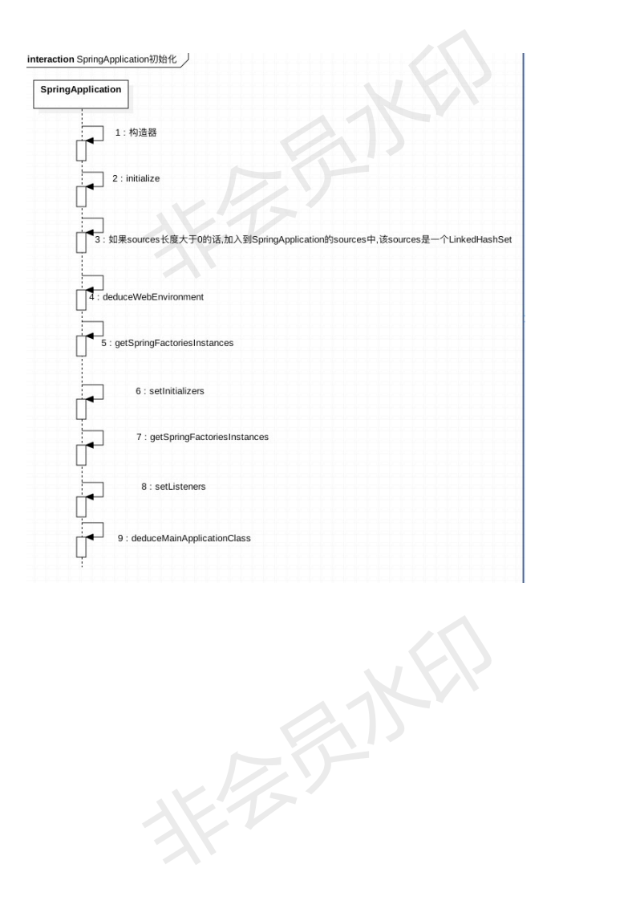
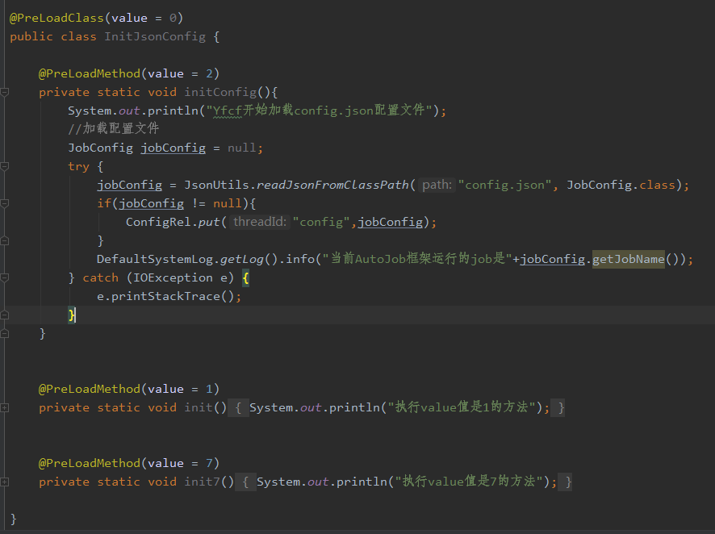

经常遇到需要在Spring容器加载前预先执行一些方法,
常用的有Aware接口、InitializingBean接口、DisposableBean接口、ImportBeanDefinitionRegistrar接口、BeanPostProcessor接口、BeanFactoryPostProcessor接口、BeanDefinitionRegistryPostProcessor接口
这些前提都是spring项目已经开始启动,类似yfcf这种需要预先从config.json加载一些差异化的文件就无法满足这种需求

#### EnableAutoConfig注解
>yfcf继承了SpringApplicationBuilder类,重写了initializers方法,让配置文件优先于springboot容器加载
>
>
>
>

##### 使用简介
>**1. 在cn.com.yto56.yfcf.core.init包下,书写自己的类**

>**2. 加入PreLoadClass注解，可以指定value值，代表优先级(这些都在springboot容器启动前)**

>**3. 加入PreLoadMethod注解，可以指定value值，代表优先级(同一个类中方法的优先执行顺序)**

>**4. 注意方法要定义成静态无返回值,也不要传参**