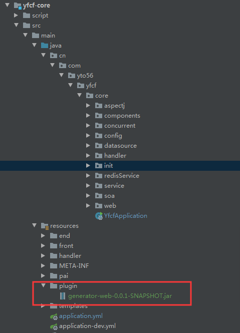
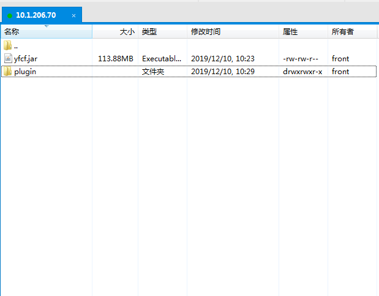

### 问题描述

Spring-Boot 项目打包后是一个FatJar 即把所有依赖的第三方jar也打包进自身的jar中，运行时 classpath 包括 FatJar 中的 BOOT-INF/classes 目录和 BOOT-INF/lib 目录下的所有jar。

那么问题是要想加载外部化 jar 就只能打包期间把 jar 依赖进去，无法实现可插拔式插件化拓展。

> 一个 Spring-Boot JAR 启动的流程可以分为以下几步：

1. 通过 java -jar spring-boot-app.jar args... 命令启动
2. JVM 读取该 jar 的 META-INF/MANIFEST.MF 文件中的 Main-Class，在 Spring-Boot JAR 中这个值通常为 org.springframework.boot.loader.JarLauncher
3. JVM 调用该类的 main 方法，传入参数即上述命令中参数
4. JarLauncher 构建 ClassLoader 并反射调用 META-INF/MANIFEST.MF 中的 Start-Class 类的 main 方法，通常为项目中的 Application 类
5. Application 类的 main 方法调用 SpringApplication.run(Application.class, args); 以最终启动应用


> 传统的java工程，当启动一个应用时，仅支持启动一个，yfcf创新支持在项目启动的时候，再启动其他无关jar包的功能

>比如我需要另外一个项目的web服务，而我并不是需要去获得它的数据交互，只是做打开主页使用某个功能，如果单独启动项目，有些资源浪费，引入maven工程，还需要上传到私服

## 独立方式

```
1.开发环境
把需要额外启动的jar，放在resources的plugin下即可

```
  
```
2.生产环境,在yfcf.jar路径下，新建plugin文件夹，把需要额外启动的jar包放在里面即可
```
  


## 依赖方式
> 这种方式适合依赖的jar和yfcf不是隔离关系，采用这种适合Ioc容器中各种类的依赖调用
前提这个pom包已经上传到私服
```
 <profile>
            <id>develop-plugin-profile</id>
            <dependencies>
                <dependency>
                   	<groupId>cn.com.yto56.yfcf</groupId>
                   	<artifactId>generator-web</artifactId>
                    <version>LATEST</version>
                </dependency>
            </dependencies>
        </profile>
```


> **yfcf项目重启或进程结束后,会自动调用Jvm的ShutDownHook杀掉启动的依赖jar包相关进程**

1. 程序正常退出
2. 使用System.exit()
3. 终端使用Ctrl+C触发的中断
4. 系统关闭
5. 使用Kill pid命令杀死进程
