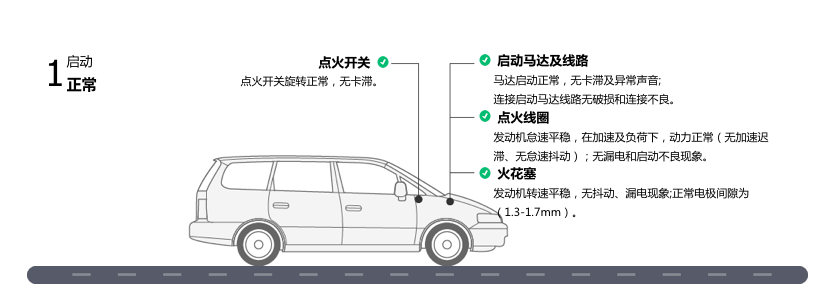
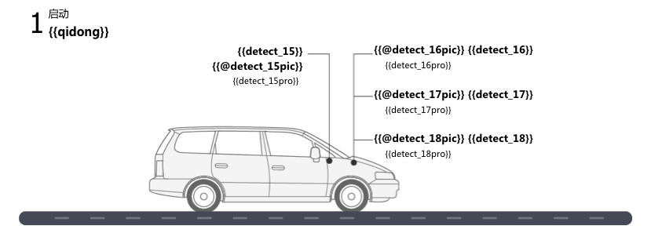
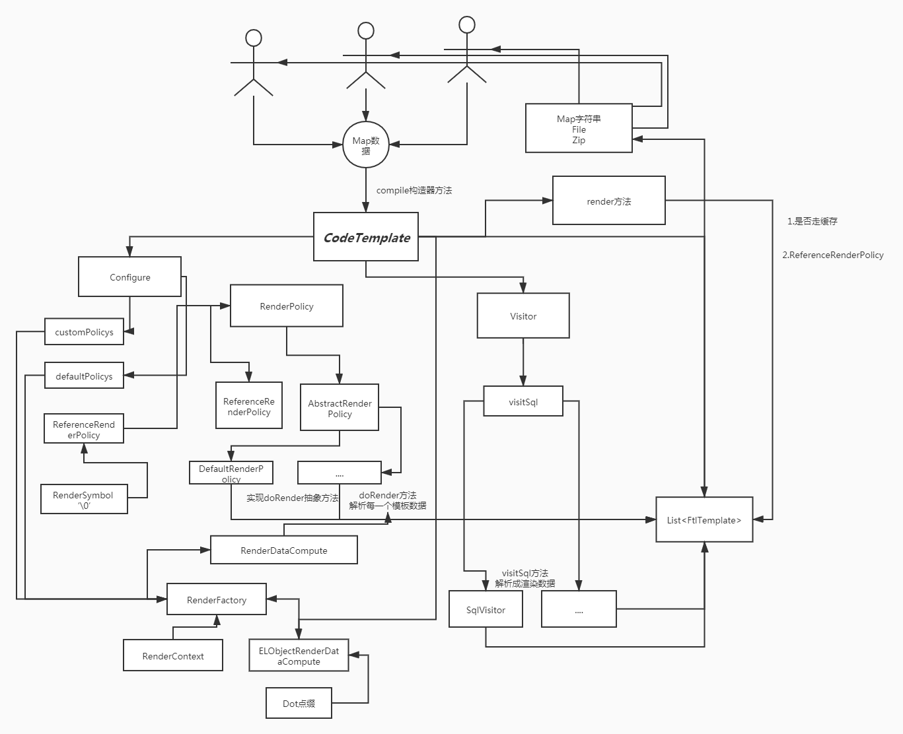
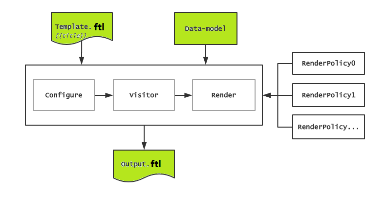
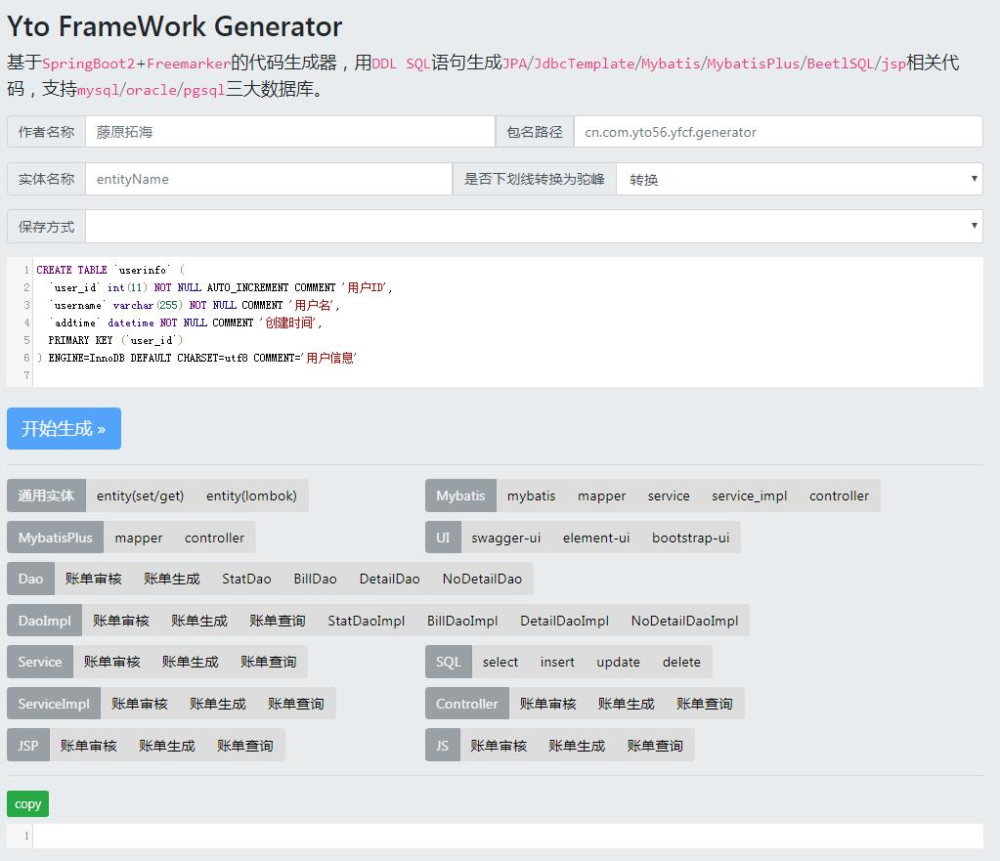
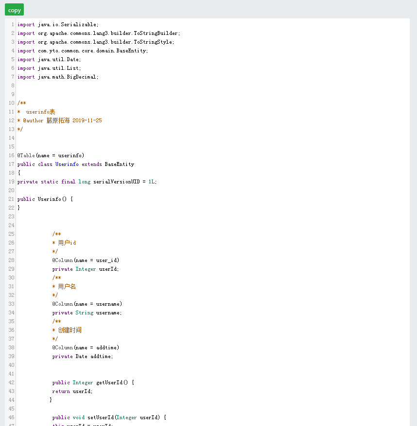
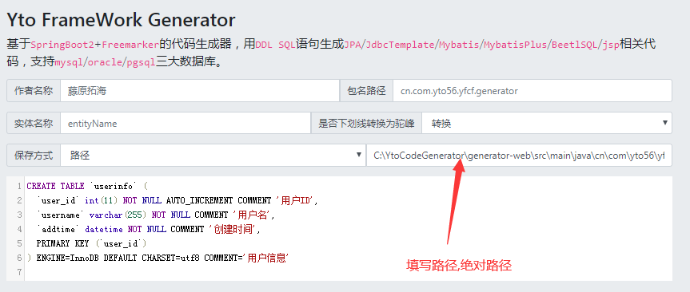
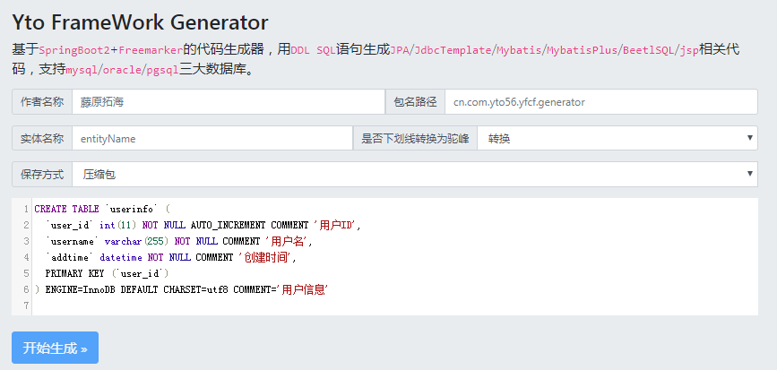

### 引擎设计

了模板配置功能，比如语法配置和插件配置，Visitor提供了模板解析功能，RenderPolicy是渲染策略扩展点，Render模块提供了RenderDataCompute表达式计算扩展点，通过RenderPolicy对每个标签进行渲染。模板和插件构建了整个Yto-Generator的核心，引擎实现了模板功能并且支持最大的扩展性
整体设计采用了Template + data-model = output模式，*Configure*提供了模板配置功能，比如语法配置和插件配置，*Visitor*提供了模板解析功能，*RenderPolicy*是渲染策略扩展点，*Render*模块提供了*RenderDataCompute*表达式计算扩展点，通过**RenderPolicy**对每个标签进行渲染。

> 思路导图
    

> 模板引擎图

###  核心类

- Configure
- ReferenceRenderPolicy
- AbstractRenderPolicy
- RenderDataCompute
- Render
- Visitor
- FtlTemplate
- TableParseUtil
- CodeTemplate

> https://www.processon.com/view/link/5dfc3dfbe4b00cdf4f0d281d

> 流程图
>

>前端界面

>代码生成方式有三种

## Web生成
  
## 路径生成
  
## 压缩包生成
       

