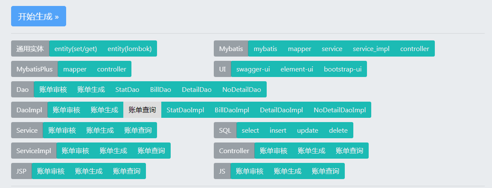

>属性介绍

> 详细说明
----
    1. 开发者的名称信息 默认为yto
    2. 代码生成后类的包路径 默认为cn.com.yto56.yfcf.generator
    3. 实体名称 代码生成的类名(IEntityNameBillAuditDao IEntityNameBillAuditJdbcDao) 默认EntityName 
    4. 数据库表sql中的下划线转换为驼峰 如数据库中有user_id,转换成实体类为userId 默认是转换
    5. 保存方式 默认不勾选就是web,可选有路径(此时必填路径绝对地址),zip压缩包方式
    6. Sql的建表语句脚本 解析器已经对sql做了注释等无用信息过滤,只需把sql脚本的所有代码copy进来即可(推荐使用navicat)
    7. 点击后即可生成对应类型的代码了
#####  效果图   
   
  成功生成的代码会从灰色变成绿色,失败的代码仍然是灰色
   