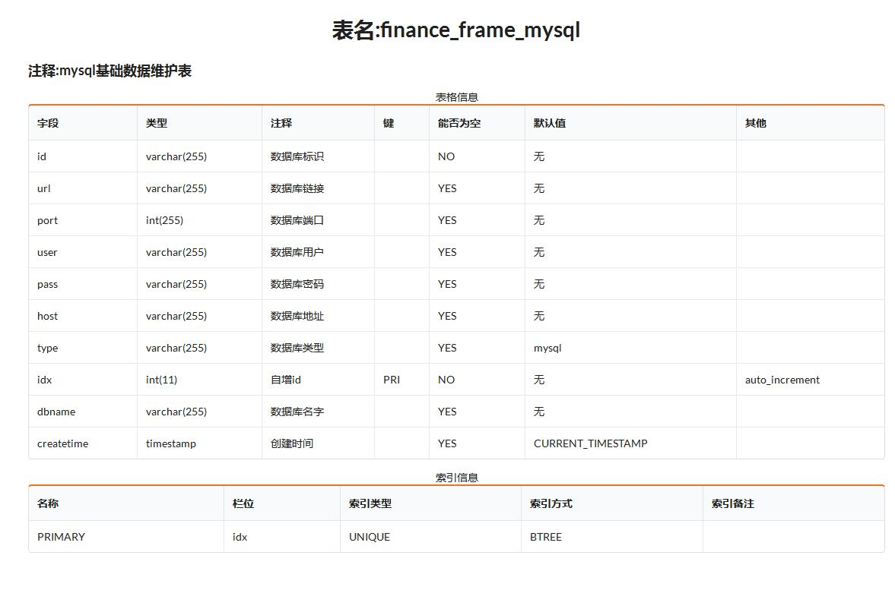
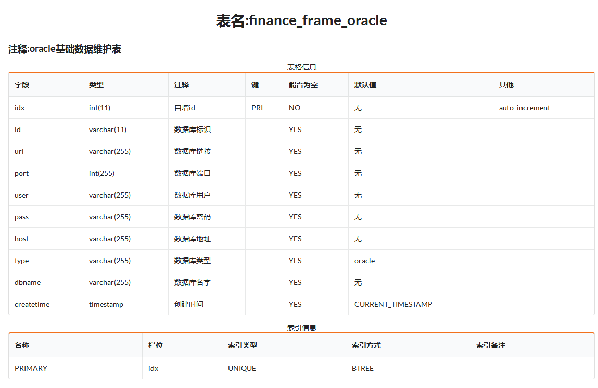
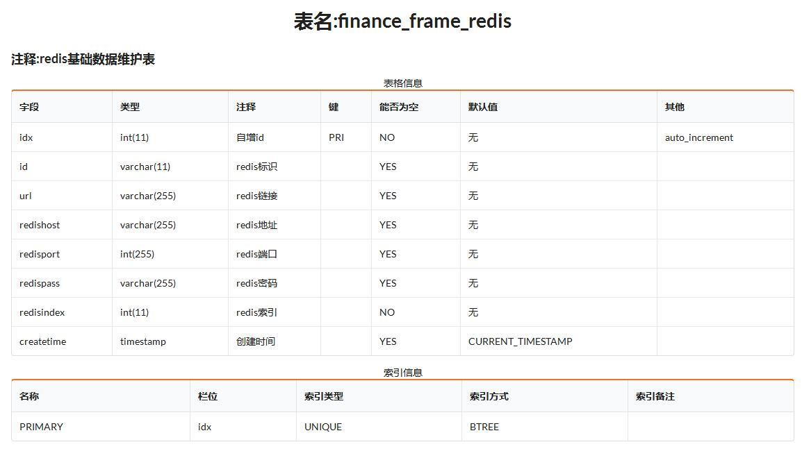
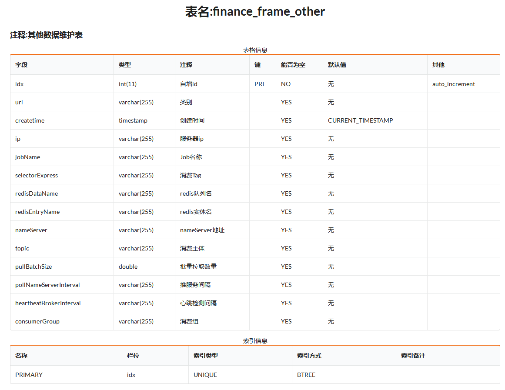

>配置表主要有四个

1. finance_frame_mysql
2. finance_frame_oracle
3. finance_frame_redis
4. finance_frame_other

   
> Mysql表结构

   
   
> Oracle表结构

      
   
> Redis表结构

        
   
> Other表结构

       