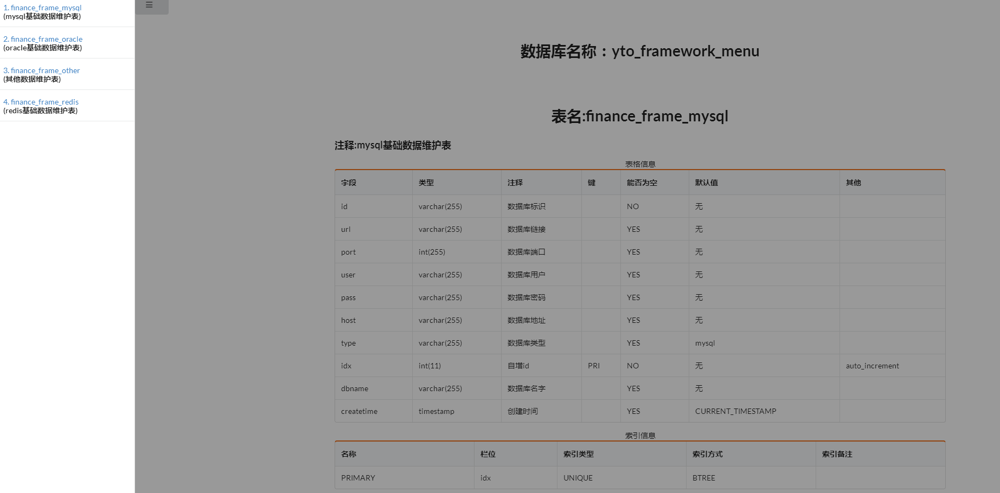

> 生成表结构项目
 
[dbDoc](https://gitee.com/zjz0812/dbDoc.git)

	
效果图  
----
 

数据库文档生成工具
====
    简单配置，就能够生成数据库文档

使用方法  
----
    1.修改application.properties的数据库配置信息  
    2.修改application.properties中的属性 application.generator中的信息
    3.运行Application.java  
    4.生成文件的格式类似2019-09-05_01-46-497.html

使用的框架  
----
    1.spring boot  
    2.spring jdbc  
    3.freemaker  

支持的数据库 
----
    mysql  
    
支持生成的文档类型
----
	1.word
	2.excel
	3.html

如何扩展已支持更多数据库
----
    1.在pom.xml加入数据库驱动包
    2.修改application.properties的数据库配置信息
    3.创建一个新的类，继承cn.com.yto56.frameworkJob.doc.generator.dao.impl.AbstractDbInfoDao
    4.在枚举类cn.com.yto56.frameworkJob.doc.generator.enums.DbType增加一个新的枚举
    
如何扩展已支持更多的生成文档类型
----
	1.创建一个新的类，继承cn.com.yto56.frameworkJob.doc.generator.service.impl.AbstractGeneratorServiceImpl
	2.在枚举类cn.com.yto56.frameworkJob.doc.generator.enums.TargetFileType中增加一个新的枚举
	