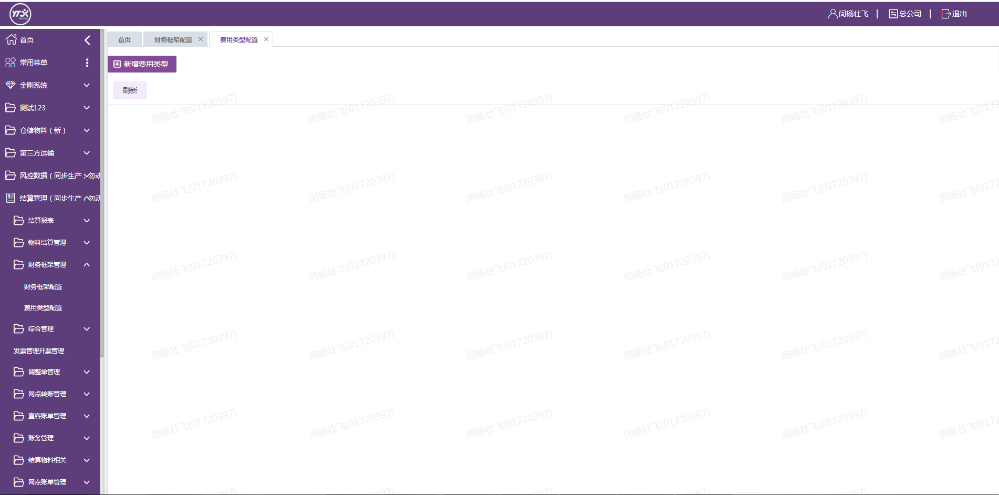
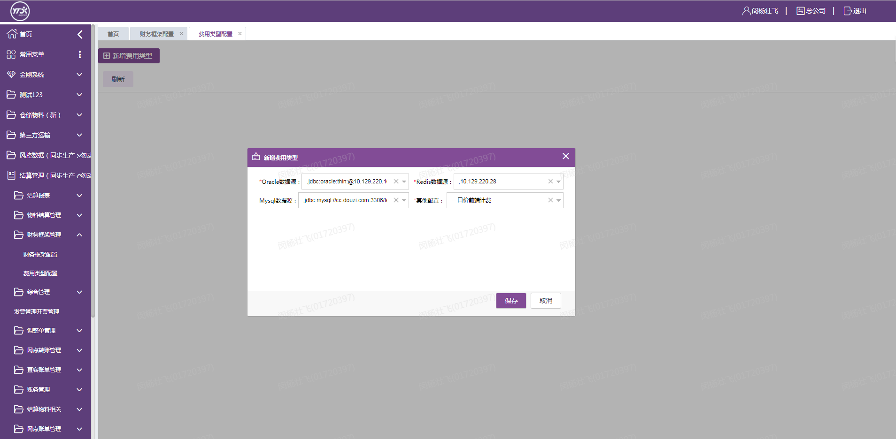

> 生成文件配置界面
  
  
> 选择参数

1. 选择数据源 支持多选
2. 选择Redis 支持多选
3. 选择其他类型的属性
4. 点击保存，生成指定的config.json
   
> 生成配置文件
   
 
> 配置文件示例
    
   ```
       {
          "jobName":"FixedPriceEndBizService","pullBatchSize":"100","redisEntryName":"StlElementNoticeEntity","ip":"172.16.51.94","dbConfigs":
          [
             {
                "host":"10.129.220.16","id":"db1","passWord":"HOXWpMYx3o","port":"1521","url":"jdbc:oracle:thin:@10.129.220.16:1521:uatmdm","userName":"ytstl"
             },{
                "host":"10.129.220.16","id":"fre_mdm","passWord":"M9RiEODE","port":"1521","url":"jdbc:oracle:thin:@10.129.220.16:1521:uatmdm","userName":"ytmdm"
             },{
                "host":"10.129.220.16","id":"fre","passWord":"ytfre_qsct","port":"1521","url":"jdbc:oracle:thin:@10.129.220.16:1521:uatmdm","userName":"ytfre"
             },{
                "host":"cc.douzi.com","id":"test","passWord":"odao#mandao@2018","port":"3312","url":"jdbc:mysql://cc.douzi.com:3312/test?useUnicode=true&characterEncoding=utf8&zeroDateTimeBehavior=convertToNull&useSSL=true&serverTimezone=GMT%2B8&allowMultiQueries=true&rewriteBatchedStatements=true","userName":"root"
             }
       
          ],"redisDataName":"NOTICE:STL_AUTO_TAKING_REDIS_LIST","url":"一口价前端计费","nameServer":"10.1.232.108:9876;10.1.232.109:9876","pollNameServerInterval":"30000","topic":"stl-all-feetype-notice-uat","heartbeatBrokerInterval":"30000","selectorExpress":"740||745","consumerGroup":"stl-abstract-job-fixedprice-end-uat","redisConfigs":
          [
             {
                "host":"10.129.220.28","port":"7369"
             }
       
          ]
       
       }
       ```